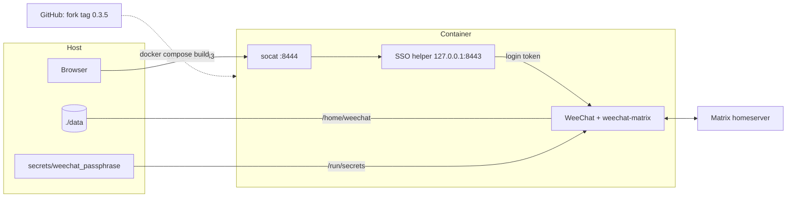

# weechat-matrix-docker

[](LICENSE)
[](https://weechat.org)
[](https://alpinelinux.org)
[](https://github.com/ChristianBoehm/weechat-matrix/releases/tag/0.3.5)

**Matrix in your terminal, always connected.** [WeeChat](https://weechat.org)
with the Matrix script in a small Alpine container that runs in the
background, keeps your session alive and stores everything on the host.

## Why

The original [weechat-matrix](https://github.com/poljar/weechat-matrix) has
been unmaintained since 2023, and the packaged version has rough edges: the
SSO login helper doesn't start on Alpine, the login is forgotten on every
restart, and the session can't verify itself in Element. This image installs
the maintained [fork](https://github.com/ChristianBoehm/weechat-matrix), which
fixes all of that, and wraps it in a setup that just keeps running.

## Features

- **End-to-end encryption that works with Element.** The session signs itself
  with your recovery key and shows as verified. Old messages are unlocked from
  the server-side key backup. New devices of your contacts are trusted
  automatically, like in Element.
- **SSO-only homeservers.** The browser login is bridged into the container.
  You log in once; the token survives restarts and temporary server errors.
- **Runs headless.** `restart: unless-stopped`, config changes saved
  automatically, commands can be sent without opening the UI.
- **Secrets stay out of the image.** WeeChat's `/secure` data is encrypted
  with a passphrase passed in as a Compose secret.
- **Apple Silicon and x86.** Multi-arch Alpine base, runs natively on both.

## How it works



- **Login:** the homeserver redirects the browser to `127.0.0.1:8443`. Docker
  forwards that to socat, which hands it to the script's SSO helper inside the
  container.
- **State:** `./data` is mounted as the container's home: config, encryption
  keys, access token and logs all live on the host and survive rebuilds.
- **Build:** the script is fetched from the fork's signed tag, so the repo
  builds anywhere without a local checkout.

## Quick start

You need Docker with BuildKit (Docker Desktop, or Docker Engine 23+ with the
Compose plugin).

**1. Clone and create the passphrase**

```bash
git clone https://github.com/ChristianBoehm/weechat-matrix-docker.git
cd weechat-matrix-docker

mkdir -m 700 secrets data
openssl rand -base64 33 > secrets/weechat_passphrase
chmod 600 secrets/weechat_passphrase
```

**2. Start and attach**

```bash
docker compose up -d
docker compose attach weechat     # Ctrl-P Ctrl-Q detaches again
```

**3. Encrypt WeeChat's secured data** (once)

```
/set sec.crypt.passphrase_command "cat /run/secrets/weechat_passphrase"
```

```bash
docker compose exec -T weechat sh -c \
  'printf "*/secure passphrase %s\n" "$(cat /run/secrets/weechat_passphrase)" > ~/.cache/weechat/weechat_fifo_1'
```

**4. Log in**

<details>
<summary>Homeserver with password login</summary>

```
/matrix server add myserver matrix.example.org
/set matrix.server.myserver.username <your-user>
/secure set matrix_password <password>
/set matrix.server.myserver.password "${sec.data.matrix_password}"
/matrix connect myserver
/set matrix.server.myserver.autoconnect on
```

</details>

<details>
<summary>SSO-only homeserver (e.g. university or company login)</summary>

```
/matrix server add myserver matrix.example.org
/set matrix.server.myserver.sso_helper_listening_port 8443
/matrix connect myserver
```

WeeChat prints a login URL. Open it in a browser **on the Docker host** and
sign in. Then:

```
/set matrix.server.myserver.autoconnect on
```

</details>

**5. Set up encryption** (optional, recommended)

```
/olm cross-sign <recovery key>        # session shows as verified in Element
/olm backup restore <recovery key>    # unlock older encrypted messages
```

The recovery key is in Element under Settings → Security & Privacy. Details in
[USAGE.md](USAGE.md#verifying-the-weechat-session-cross-signing).

## Everyday commands

| Task | Command |
|---|---|
| Open the UI | `docker compose attach weechat` |
| Leave the UI, keep running | <kbd>Ctrl</kbd>-<kbd>P</kbd> <kbd>Ctrl</kbd>-<kbd>Q</kbd> |
| Stop / start | `docker compose down` / `docker compose up -d` |
| Restart | `docker compose restart` |
| Send a command without the UI | `docker compose exec -T weechat sh -c "echo '*/matrix server list' > ~/.cache/weechat/weechat_fifo_1"` |
| Read the server log | `tail -f data/.local/share/weechat/logs/python.server.myserver.weechatlog` |

## Configuration

| Setting | Where | Default |
|---|---|---|
| Trust new devices of other users automatically | `MATRIX_AUTO_IGNORE_NEW_DEVICES` in `docker-compose.yml` (`on` / `off`; remove the line to keep the value from `matrix.conf`) | `on` |
| SSO callback port | `ports:` in `docker-compose.yml` (bound to localhost only) | `127.0.0.1:8443` |
| Script version | fork tag in `additional_contexts` + version check in the `Dockerfile` | `0.3.5` |

## Data and backup

| Path | Contents |
|---|---|
| `data/` | WeeChat config, encryption keys, Matrix access token, logs |
| `secrets/` | passphrase for WeeChat's encrypted `/secure` data |

Both are created locally and ignored by git and by the Docker build context.
Back them up together while the container is stopped:

```bash
docker compose down
tar czf weechat-backup.tgz data secrets
```

**Moving to another machine:** restore both next to a fresh clone and start.
Matrix sees the same device, so it stays verified and old messages stay
readable. Never run two copies of the same `data/` at once. On Linux, `data/`
must belong to UID 1000 (the container's `weechat` user).
More in [USAGE.md](USAGE.md#persistence--backup).

## Security notes

- The SSO port is published on `127.0.0.1` only, not on the network.
- `data/` and `secrets/` should be `chmod 700`; the access token file is `0600`.
- Recovery keys are passed to the helper on stdin and are only stored if you
  put them into WeeChat's encrypted `/secure` data.
- Losing `secrets/weechat_passphrase` makes the `/secure` data unreadable.
  Back it up with `data/`.

## Limitations

- `/python reload matrix` fails (a Python library can't be loaded twice); use
  `docker compose restart`.
- The session can verify itself, but not other users via cross-signing.
- Room keys can be restored from the key backup, but not uploaded to it.
- No WeeChat relay by default (add `weechat-relay` to the `Dockerfile` to use
  a phone or web client).

## Upgrading

```bash
docker compose build --pull
docker compose up -d
```

`data/` is untouched. For a new script release, change the tag in
`docker-compose.yml` (`…weechat-matrix.git#<tag>`) and the version check in the
`Dockerfile`, then build again. See [USAGE.md](USAGE.md#upgrade).

## Credits and license

- [WeeChat](https://weechat.org) by Sébastien Helleu and contributors.
- [weechat-matrix](https://github.com/poljar/weechat-matrix) by Damir Jelić
  (ISC), continued in [this fork](https://github.com/ChristianBoehm/weechat-matrix).

The files in this repository are [MIT](LICENSE)-licensed.
